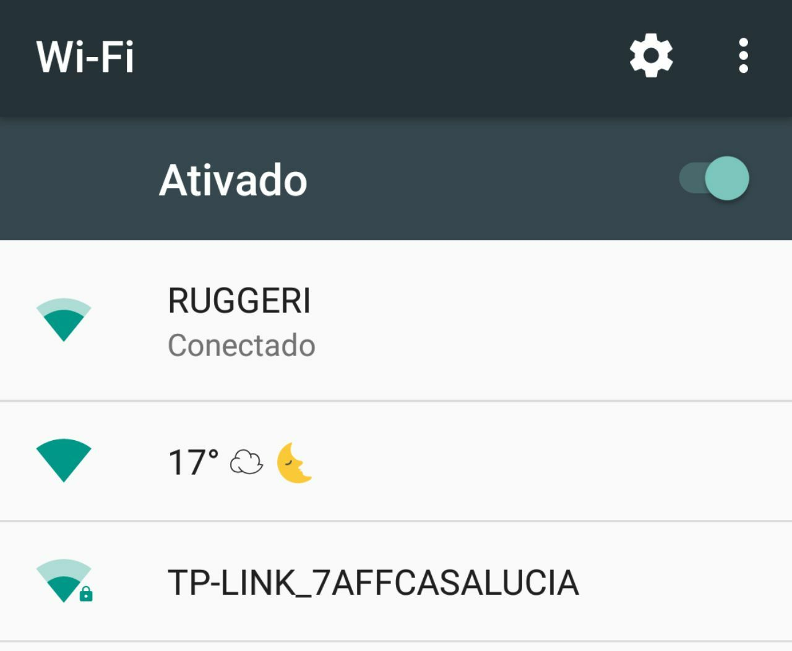

# Wheather-fi

Broadcast the wheather as wifi ssid on a ESP8266



## How to run

- Plug an nodeMCU devkit or a ESP8266 with serial adapter on the USB
- If it didn't came prealoaded with nodeMCU lua interpreter, then flash it first

```shell
npm install -g nodemcu-tool
nodemcu-tool init
nodemcu-tool upload init.lua
nodemcu-tool run init.lua
```
